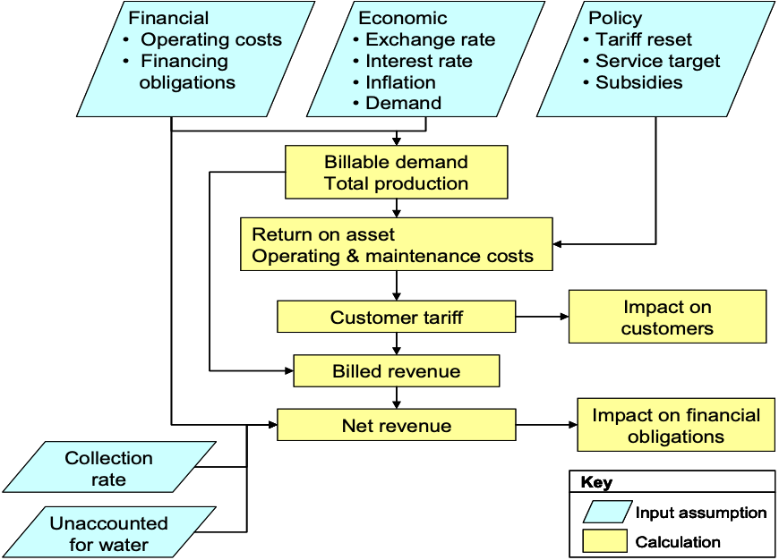
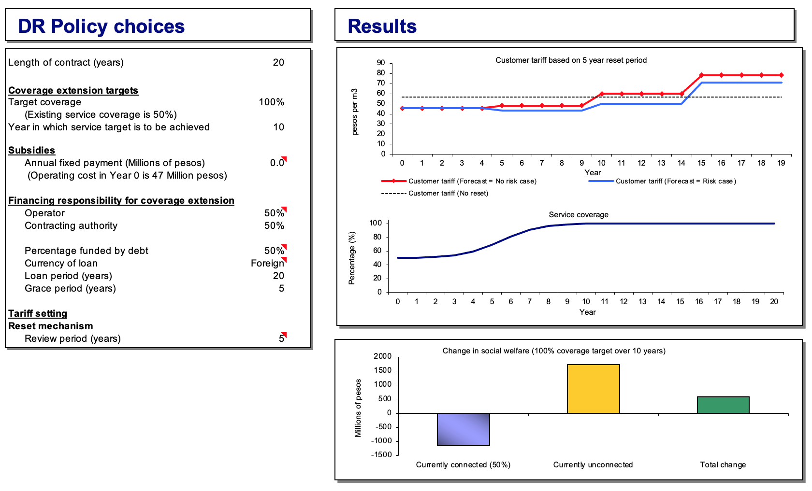
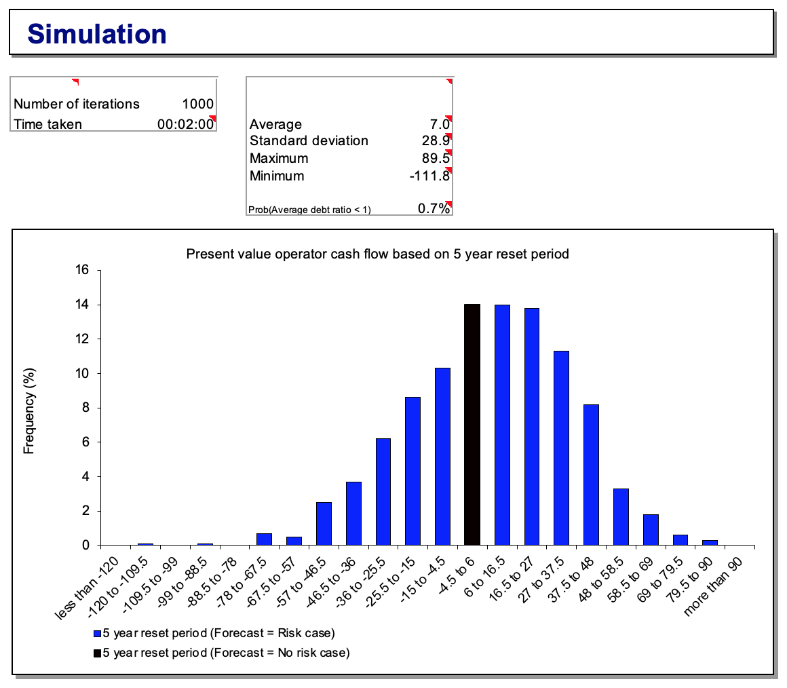

```{r setup, include=FALSE}
rm(list = ls())
graphics.off()
require(dplyr)

# knitr::opts_chunk$set(echo = TRUE, message = FALSE, warning = FALSE)
knitr::opts_chunk$set(
  collapse=TRUE,
  comment="",
  message=FALSE,
  warning=FALSE,
  cache=FALSE,
  fig.align = "center"
)

format.dt.f = function(
  df, 
  page_length = 10,
  perc_vars=NA,
  ron_vars=NA,
  ron_digits=2
){
  if( is.null(df) | purrr::is_empty(df) ){return()}
  
  double.two.int.f = function( df ){
    get_no_digits = function(x){
      if( ! is.numeric(x) ){return(NULL)}
      x = x %% 1
      x = as.character(x)
      no_digits = nchar(x) - 2
      no_digits = ifelse( no_digits == -1, 0, no_digits )
      return(no_digits)
    } 
    suppressWarnings({
      new_df = df %>%
        as_tibble() %>%
        mutate_if( function(x) max( get_no_digits(x), na.rm = T ) == 0, as.integer )
    })
    return(new_df)
  }
  df = double.two.int.f( df )
  max_length = nrow(df)
  page_length_menu = c(10,25,50,100, max_length, page_length) %>% unique()
  page_length_menu = page_length_menu[ !page_length_menu > max_length]
  
  dt = DT::datatable(
    df, 
    extensions = c('Buttons', 'ColReorder', 'KeyTable', 'FixedColumns'), 
    rownames = FALSE, 
    options = list(
      dom = 'Bflrtip', 
      buttons = I( c('colvis','copy', 'excel') ), 
      # colReorder = TRUE, 
      keys = TRUE, 
      pageLength = page_length, 
      lengthMenu = page_length_menu #,
      # scrollX = TRUE,
      # scrollCollapse = TRUE
    )
  )
  
  if (!is.na(ron_vars)[1]) dt=dt %>% DT::formatRound( ron_vars, ron_digits )
  if (!is.na(perc_vars)[1]) dt=dt %>% DT::formatPercentage( perc_vars, 2 )
  
  return(dt)
}
```

# MOTIVATION

>How to best allocate business responsibilities and risks and how to design tariff adjustment and other rules to achieve the desired allocation in a public-private-partnership.

Under public provision the contracting authority is responsible for managing the business, operating and maintaining the assets, investing in new assets, and financing the business. In some concessions and divestitures, the operator has practically all the business responsibilities. Business responsibilities exclude such policy responsibilities as setting tariffs and quality standards. But in management contracts, affermages-leases, and hybrid arrangements, business responsibilities are shared between the operator and the contracting authority. A big part of designing the arrangement is deciding how to allocate business responsibilities between the operator and the contracting authority.

Allocating risks is less intuitive than allocating responsibility, but it is also a large part of designing the arrangement. Risks come about because the post-COVID economy is unpredictable. Demand for water services in the Dominican Republic, for example, may be higher or lower than forecast. Costs may be higher or lower than forecast. USD vs DOP (US Dollars to Dominican Pesos) exchange rate will change. The question is, who should bear these risks? Who should bear the losses or experience the gains? If the operator bears cost risks, for example, then the operator makes bigger profits if costs fall and smaller profits-or losses-if costs rise. On the other hand, if customers bear cost risks, then customers lose if costs rise and win if they fall; the operator’s profits are unaffected.

It is useful to think about responsibilities and risks/returns together. Operators may be given responsibility for the things they are able to do better than government, and may take the risks naturally associated with those responsibilities. For example, if the operator is responsible for collections, it will often be a good idea for the operator to bear collection risk (that is, for the operator’s profits to depend in part on the utility’s ability to collect what customers owe).

Many risks are allocated by the rules for adjusting tariffs: what usually determines whether the operator or customers bear cost risks, for example, is whether the rules allow tariffs to change in line with changes in cost. The basic process for allocating responsibilities and risks is as follows:
  
-Identify the main areas of responsibility involved in delivering the services and the risks associated with each responsibility
-Allocate each area of responsibility and risk to the party best able to manage it
-Design the arrangement to achieve this allocation of risks and responsibilities.


# MODELING

The core of this model is a standard financial analysis of a water utility. Some of the inputs are facts about the utility and the Dominican Republic, such as the number of customers, demand per customer, operating costs, inflation, and the exchange rate. Other inputs are policy choices, such as coverage targets, rules for adjusting tariffs, and whether the operator is responsible for financing investment. Combined, the inputs generate the outputs such as the average tariffs, the number of people connected to the network, and the profitability of the operator. Further, because this routine allows demand, inflation, and the exchange rate to fluctuate randomly, it can illustrate the analysis of risk relating to these variables, including the analysis of different allocations of these risks. For example, the model can estimate the extent to which the operator’s cash flows or value varies with fluctuations in these variables and the probability of those fluctuations leading to the operator defaulting on its debt. In the algorithm, the allocation of risks related to demand, inflation, and the Dominican peso exchange rate is affected by the rules for adjusting tariffs. Risks relating to default are also influenced by the proportion of investment financed by debt and whether the debt is in peso or dollar. For example, if USD debt is chosen, the risk of default rises. Given a set of factual assumptions, this function can estimate the probability of default given different choices of tariff reset period and different assumptions about the operator’s debt, coverage targets, and so on. Using the same techniques, the function also illustrates the risks of tariff changes faced by customers.

<!--
Last but not least, the policy maker should keep in mind that this function is not complete and it is not ready for real-world arrangement (yet!). For one thing, it ignores taxes, it also assumes there is only one type of customer, and lumps operating costs into just two categories (fixed and variable), rather than separately identifying labor, electricity, and other inputs. It also missing many economically important linkages, such as feedback from tariffs to demand and from demand to required investment. Nor does it generate a full set of financial statements for the operator or utility. 
-->

<center>
{ width=50% }
</center>


# PARAMETERS


```{r, echo=FALSE}
format.dt.f(
  readr::read_csv("../inputs/inputs.csv", col_names = FALSE) %>%
    setNames(c("VARIABLE", "VALUES"))
)
```

# FORMULATIONS

## DETERMINISTIC


```{r, echo=FALSE}
format.dt.f(readr::read_csv("../output/no_risk.csv"))
```


## STOCHASTIC

```{r, echo=FALSE}
format.dt.f(readr::read_csv("../output/risk.csv"))
```


# RESULTS


<center>
{ width=100% }
</center>

<center>
{ width=100% }
</center>

# CODE

Written by <a href="https://www.linkedin.com/in/carlosarias-perez/" target="_blank">Carlos Arias Perez</a> and <a href="https://www.linkedin.com/in/rnfc/" target="_blank">Rafael Nicolas Fermin Cota</a>.

Last Update `r Sys.Date()`

<style>
.main-container { width: 1200px; max-width:2800px;}
</style>

```{r}
source("../libs/code.R") # 
WATER_UTILITY_SAMPLING_FUNC
```


# GLOSSARY


- **CONTRACT_LENGTH_VAL**: (eg., $20$)        

- **INFLATION_CURRENT_VAL**: Current value of inflation. It is the rate of change of the Consumer Price Index. (eg., $0.05$)            

- **INFLATION_SPEED_ADJUSTMENT_VAL**: The rate at which current inflation will tend towards its long term value. (eg., $5$)        

- **INFLATION_LONG_TERM_VAL**: Long term value of inflation. This is the long term rate that the current inflation will tend towards. (eg., $0.08$)       

- **INFLATION_VOLATILITY_VAL**: Uncertainty around the inflation over oneyear period. A $1$ volatility means that over the period of one year inflation has the potential to go up or down by $1$.  (eg., $0.02$)          

- **INFLATION_INTIAL_CPI_VAL**: (eg., $100$)

- **INFLATION_INTIAL_DEFLATION_FACTOR_VAL**: (eg., $1$)  

- **EXCHANGE_RATE_CURRENT_VAL**: Current value of the exchange rate expressed in terms of pesos per dollar. (eg., $100$)       

- **EXCHANGE_RATE_DEPRECIATION_VAL**: Expected annual change in the exchange rate. A positive change is a depreciation of the currency more pesos per dollar and a negative change is an appreciation of the peso. (eg., $0.05$)

- **EXCHANGE_RATE_VOLATILITY_VAL**: Uncertainty around the exchange rate over oneyear period. A $1$ volatility means that over the period of one year the exchange rate has the potential to go up or down by $1$.  (eg., $0.05$)

- **DISCOUNT_INITIAL_FACTOR_VAL**: (eg., $1$)

- **DISCOUNT_RATE_VAL**: Discount rate applied to determine net present values. This is also the *Weighted Average Cost of Capital*. (eg., $0.07$)

- **CUSTOMERS_CURRENT_VAL**: Current value of the number of households in the economy. This is the maximum number of connections that the private operator can hope to gain. (eg., $50000$)

- **CUSTOMERS_ANNUAL_GROWTH_VAL**: (eg., $0$)

- **SERVICE_COVERAGE_CURRENT_VAL**: Current service coverage is the number of households that are currently connected divided by the total number of households. (eg., $0.5$)

- **SERVICE_COVERAGE_TARGET_VAL**: Coverage extension target coverage. Existing service coverage is $50$ (eg., $1$)

- **SERVICE_COVERAGE_YEAR_VAL**: Year in which service target is to be achieved (eg., $10$)

- **DEMAND_CURRENT_VAL**: Current demand per connection per day expressed in litres. (eg., $150$)

- **DEMAND_OTHER_SOURCES_VAL**: Current usage of water from other sources expressed as litres per household per day.This demand is assumed to stay constant. (eg., $75$)

- **DEMAND_ANNUAL_GROWTH_VAL**: Household demand is assumed to grow at a constant rate with some variability around this. (eg., $0.02$)

- **DEMAND_VOLATILITY_VAL**: (eg., $0.03$)

- **DENOMINATIONS_WATER_VOLUMES_VAL**: (eg., $1000000$)

- **NON_REVENUE_WATER_CURRENT_VAL**: Nonrevenue water include Unaccounted for water UFW and water used for public services such as firefighting. (eg., $0.01$)

- **NON_REVENUE_WATER_TARGET_VAL**: Nonrevenue water is assumed to decrease from current level to a target level. The minimum value this can take is $0$. (eg., $0.03$)

- **NON_REVENUE_WATER_YEAR_VAL**: The year in which the target level of nonrevenue water is to be reached. (eg., $5$)

- **COLLECTION_RATE_CURRENT_VAL**: Collection rate is the proportion of total billed demand that the operator can collect. The remainder is assumed to be bad debt. (eg., $1$)

- **COLLECTION_RATE_TARGET_VAL**: Collection rate is assumed to gradually increase from current level to a target level. (eg., $1$)

- **COLLECTION_RATE_YEAR_VAL**: Year in which the collection target is to be achieved. (eg., $10$)

- **DENOMINATIONS_MONETARY_VAL**: (eg., $1000000$)

- **INVESTMENT_COST_PER_NEW_CONNECTION_LOCAL_CURRENCY_VAL**: Investment cost per connection expressed in pesos. This is a oneoff charge. (eg., $2000$)

- **FIXED_OPERATING_COSTS_EXISTING_PERCENT_INVESTMENT_COST_PER_CONNECTION_VAL**: Proportion of investment cost assumed to be fixed operating cost. (eg., $0.4$)

- **FIXED_OPERATING_COSTS_EXISTING_COST_VAL**: Current level of fixed operating cost Proportion of investment assumed to be fixed Investment cost Current level of connections. (eg., $20000000$)

- **FIXED_OPERATING_COSTS_ANNUAL_REAL_GROWTH_RATE_VAL**: Annual real growth rate of fixed operating costs. (eg., $0.03$)

- **FIXED_OPERATING_COSTS_PROPORTION_OF_COSTS_DENOMINATED_IN_FOREIGN_CURRENCY_VAL**: Proportion of fixed costs that is assumed to be denominated in dollars and are therefore affected by changes in the exchange rate. (eg., $0.5$)

- **VARIABLE_OPERATING_COSTS_EXISTING_COST_VAL**: Variable costs per cubic meter. (eg., $20$)

- **VARIABLE_OPERATING_COSTS_ANNUAL_REAL_GROWTH_RATE_VAL**: Annual real growth rate of operating operating costs. (eg., $0.03$)

- **VARIABLE_OPERATING_COSTS_PROPORTION_OF_COSTS_DENOMINATED_IN_FOREIGN_CURRENCY_VAL**: Proportion of variable costs that is assumed to be denominated in dollars and are therefore affected by changes in the exchange rate. (eg., $0.5$)

- **PERCENTAGE_FUNDED_BY_DEBT_VAL**: The costs of coverage extension can be funded through debt for example taking out a loan or through equity that is equity injections by the private operator the contracting authority or both (eg., $0.5$)

- **LOAN_FOREIGN_CURRENCY_VAL**: If the investment is funded by debt then there is an option of either issuing this loan in domestic currency pesos or foreign currency dollars. (eg., $TRUE$)

- **LOAN_PERIOD_VAL**: (eg., $20$)

- **LOAN_PERIOD_GRACE_VAL**: (eg., $5$)

- **FINANCING_RESPONSIBILITY_COVERAGE_EXTENSION_OPERATOR_VAL**: If the private operator pays for all investment then this is set to $100$. If the contracting authority is fully responsbile then this is $0$. (eg., $0.5$)

- **FINANCING_RESPONSIBILITY_COVERAGE_EXTENSION_CONTRACTING_AUTHORITY_VAL**: (eg., $0.5$)

- **INTEREST_RATE_VAL**: Real interest rate assumed to remain constant over the life of the contract. (eg., $0.05$)

- **ASSET_BASE_INITIAL_LOCAL_CURRENCY_VAL**: Initial asset base expressed in pesos. (eg., $100000000$)

- **ASSET_BASE_DEPRECIATION_RATE_VAL**: Annual depreciation rate. Depreciation charge in each year is Depreciate rate Value of opening assets. (eg., $0.05$)

- **TARIFF_REVIEW_PERIOD_VAL**: Frequency of tariff resets. (eg., $5$)

- **ANNUAL_FIXED_FEES_PAYMENT_LOCAL_CURRENCY_VAL**: Lease payments concession fees and license fees can be represented by negative annual payments i.e. payments from the operator to the contracting authority. (eg., $0$)

- **EXISTING_TARIFF_CONNECTED_VAL**: Tariff charged to households that are connected to the water system prior to the introduction of the private operator expressed in terms of pesos per cubic meter. (eg., $30$)

- **EXISTING_TARIFF_OTHER_VAL**: Tariff charged to households that obtain water from other methods e.g. water tankers river sources expressed in terms of pesos per cubic meter. (eg., $45$)

- **EXISTING_TARIFF_COPYING_COST_VAL**: Additional cost incurred by unconnected households in order to obtain water such as time traveled to river source cost of installing water storage. (eg., $1000$)

- **WTP_CONNECTION_VAL**: Willingness to pay per cubic meter for a household connections versus other sources expressed as a percentage of what is currently charged. (eg., $2.5$)

- **WTP_OTHER_VAL**: Willingness to pay per cubic meter for a household connections versus other sources expressed as a percentage of what is currently charged. (eg., $1.5$)

- **WTP_COPYING_COST_VAL**: Willingness to incur coping costs to remain unconnected to the water system. (eg., $1.3$)


# REFERENCE

<a href="https://openknowledge.worldbank.org/handle/10986/6982" target="_blank">World Bank. 2006. Approaches to Private Participation in Water Services : A Toolkit. Washington, DC.</a>.

