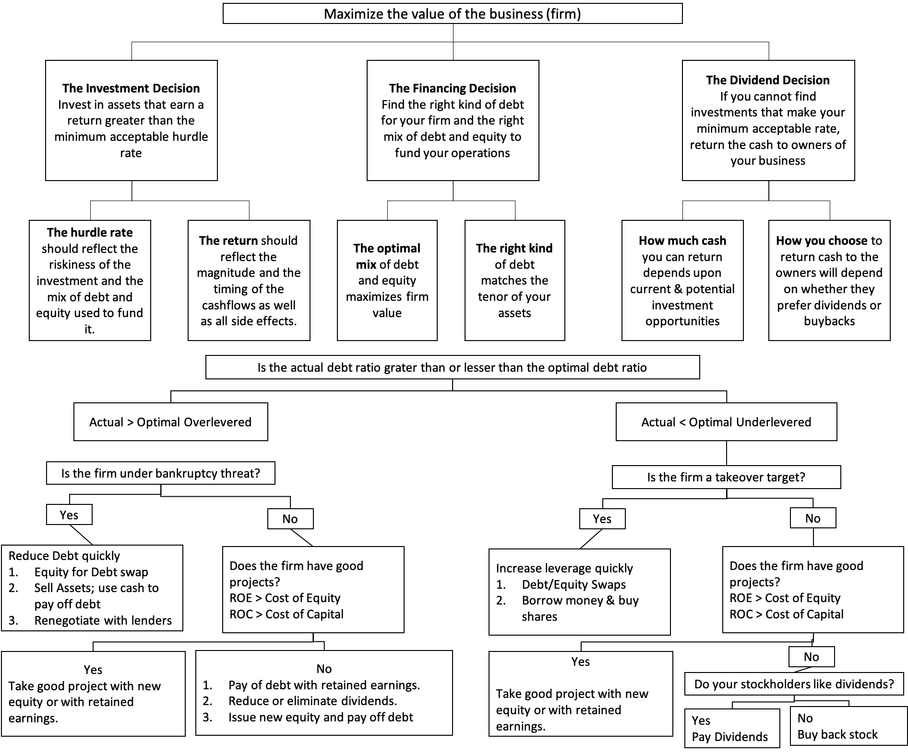

Linkedin Article: [Capital allocation via cost of capital](https://www.linkedin.com/pulse/capital-allocation-via-cost-rafael-nicolas-fermin-cota/)

The cost of capital is a ubiquitous metric for corporate executives, showing up in almost every aspect of their job description. It drives investing decisions, helps determine financing choices, and affects dividend policy and valuations. That being said, cost of capital is often mangled and misused in practice, and it seems that rather than operating within a range that minimize the cost of capital corporate executives make financing choices based upon perceptions of the cheapness (or costliness) of capital. Pre-COVID, for example, aside from refinancing more costly debt, companies were using the money raised to pay dividends to shareholders, buy other businesses, and repurchase their own stocks, you name it. As a result of this, many companies ended up with unsustainable debt-to-capital ratio levels. Essentially, I have two questions when investing in any business. First and foremost, where is the company in the capital structure? It is true that some managers and investors like me, in the name of prudence, think that less debt is always better than more debt, and no debt is optimal. And second, what do we think about the company’s excess return on invested capital? Scaling profits to invested capital yields accounting returns, and comparing those returns to costs of funding, we get excess returns, shorthand for the value created or destroyed by growth. 

Value in any business comes from its capacity to invest money and generate cash flows into the future, and defined as such, the act of returning cash by itself, either as buybacks or dividends cannot create or destroy value. It is true that the way in which dividends and buybacks are funded or the consequences that they have for investing can have value effects, but those value effects do not come from the cash return, but from investing and financing dysfunction. While a buyback or dividend, by itself, cannot affect value, the way it is funded and the investments that it displaces can determine whether value is added or destroyed. If the business is already at its right mix of debt choose to add to that debt to fund its dividend payments or buybacks, it is hurting its value by increasing its cost of capital and exposure to default risk. However, the business could be under levered, i.e., has too little debt, may be able to increase its value by borrowing more to fund its cash return, with the increase coming from the skew in the tax code towards debt.

If you have taken a corporate finance class sometime in your past life are probably wondering how the "Right" Financing Mix approach reconciles with the [Miller-Modigliani theorem](https://www.investopedia.com/terms/m/modigliani-millertheorem.asp), a key component of most corporate finance classes, which posits that there is no optimal debt ratio, and that the debt mix does not affect the value of a business. That theorem deserves the credit that it gets for setting up the framework that we use to assess debt today, but it also makes two key assumptions, with the first being that there are no taxes and the second being that there is no default. Removing debt's biggest benefit and cost from the equation effectively negates its effect on value. Changing the debt ratio, in the Miller-Modigliani world, will leave the cost of capital unchanged. In the real world, though, where both taxes and default exist, there is a "right" mix (albeit an approximate one) of debt and equity, and companies can borrow too much or too little.

If you can see the mechanics of how changing debt ratio changes the cost of capital, but are unclear on how lowering the cost of capital changes the value of the business, the link is a simple one. The intrinsic value is the present value of its expected free cash flows to the firm, computed after taxes but before debt payments, discounted back at its cost of capital. As the company borrows more, their free cash flows to the firm should remain unaffected, in most cases, since they are pre-debt cash flows, and a lower cost of capital will translate into a higher value, with one caveat. And as they borrow more and the risk of failure/ bankruptcy increases, there is the possibility that customers may stop buying their products, suppliers may demand cash and employees may start abandoning ship, creating a death spiral, where operating income and cash flows are affected. In that case, the optimal debt ratio for the business is the one that maximizes value, not necessarily the one at which the cost of capital is minimized.

For the past decade, I have extended my lectures far beyond what is labeled as corporate finance, introducing students to some numerical methods to show how [calculus](https://github.com/rnfermincota/academic/blob/main/research/traditional_assets/database/effective-cost-debt.pdf) can be used to get a sense of how much debt a business can safely carry. In class students also learn how to use data from trusted data vendors including [S&P Capital IQ, Bloomberg, and a host of specialized data sources](https://www.linkedin.com/pulse/162-grid-rafael-nicolas-fermin-cota-1e/) used to estimate the optimal capital structure for publicly traded companies, listed globally, and what each company can sustain in debt as we change the current debt to capital ratio to a target debt ratio. The target debt ratio is estimated by calculating the mix of debt and equity that minimizes the weighted average cost of capital of a company while maximizing its market value. My experience is that students find the optimal capital structure approach difficult at the outset and struggle to get their arms around the formulations at different debt ratios. The complications with estimating the optimal financing mix (debt-to-capital ratio level that yield the lowest cost of capital) across companies lie in two aspects. First, in the statistical problems with estimating [risk parameters](https://rpubs.com/rafael_nicolas/crp), and second, with the [financial models](https://rpubs.com/rafael_nicolas/sp500_monthly_valuation) built on these parameters. There is a way of estimating costs of capital that is agnostic about the choice of models, but it leads to circular reasoning, at least in the context of valuation. Here, the cost of capital operates as an optimizing tool for capital structure, where the price of risk is set by markets, and it enters the cost of capital in two places. When estimating the cost of equity, it manifests as an equity risk premium, and when estimating cost of debt, it shows up as a default spread. Both metrics are set by markets, reflect investor risk aversion and change over time, and this is a reductive approach in the sense that it reduces the complexity of valuation modeling. 

P.S. [In this repository](https://github.com/rnfermincota/academic/tree/main/research/traditional_assets/database), I share the optimal capital structure database with excess returns to equity and the firm for ~48,000 publicly traded companies across sectors and regions. Starting with how the market is pricing risk (both country and equity risk premiums), and then moving on to the cost of equity at each debt ratio, and then estimated the interest coverage ratio, synthetic rating, and cost of debt, taking care to ensure that if the interest expenses exceed the operating income, tax benefits would be lost. These hurdle rates also represent benchmarks that businesses have to beat to create value. When we invest capital in risky businesses, we need to not just make money, but make enough to cover what we could have earned on investments of equivalent risk. COVID, for example, was a reminder to investors that the end game for every business is to not just generate profits, but to generate enough profits to cover its opportunity costs, i.e, the returns they can make on investments of equivalent risk, and that game became a lot more difficult to win. A combination of rising risk-free rates and surging risk premiums (equity risk premiums and default spreads) has conspired to push the [cost of capital of both US and global companies](https://rpubs.com/rafael_nicolas/tour_world_economies_businesses).

