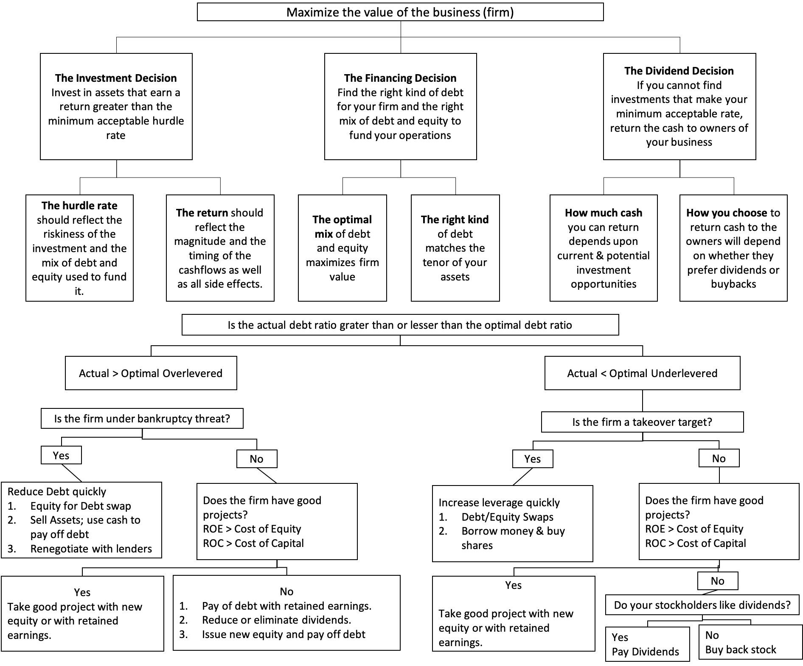

For the past decade I have extended my lectures far beyond what is labeled as corporate finance, introducing students to some numerical methods to show how calculus ([https://github.com/rnfermincota/academic/tree/main/research/traditional_assets/database/data](https://github.com/rnfermincota/academic/tree/main/research/traditional_assets/database/data)) can be used to get a sense of how much debt a business can safely carry. In class students also learn how to use data from trusted data vendors including S&P Capital IQ, Bloomberg, and a host of specialized data sources used to estimate the optimal capital structure for publicly traded companies, listed globally, and what each company can sustain in debt as we change the current debt to capital ratio to a target debt ratio. The target debt ratio is estimated by calculating the mix of debt and equity that minimizes the weighted average cost of capital of a company while maximizing its market value. My experience is that students find the optimal capital structure approach difficult at the outset and struggle to get their arms around the formulations at different debt ratios. The complications with estimating the optimal financing mix (debt-to-capital ratio level that yield the lowest cost of capital) across companies lie in two aspects. First, in the statistical problems with estimating risk parameters ([https://rpubs.com/rafael_nicolas/crp](https://rpubs.com/rafael_nicolas/crp)), and second, with the financial models built on these parameters ([https://rpubs.com/rafael_nicolas/sp500_monthly_valuation](https://rpubs.com/rafael_nicolas/sp500_monthly_valuation)). There is a way of estimating costs of capital that is agnostic about the choice of models, but it leads to circular reasoning, at least in the context of valuation. Here, the cost of capital operates as an optimizing tool for capital structure, where the price of risk is set by markets, and it enters the cost of capital in two places. When estimating the cost of equity, it manifests as an equity risk premium, and when estimating cost of debt, it shows up as a default spread. Both metrics are set by markets, reflect investor risk aversion and change over time, and this is a reductive approach in the sense that it reduces the complexity of valuation modeling.

P.S. I always advise students interested in investing to learn some coding and hope a few might be motivated by my work. For the past 15 years, I have spent my time and attention entirely on developing new data-driven technologies that would allow managers to quickly collect financial data from a growing variety of sources, while helping them make smarter better informed investment decisions before the rest of the market caught on. Coupled with more in-depth analytics, we were capitalizing on a new and increasingly essential source of alpha. I truly believe that if students learn to code in an advanced language like R or Python, it will open new avenues for their data science work, will vastly improve their productivity and will protect the future of their career as forces of automation rapidly advance in the investment industry. 