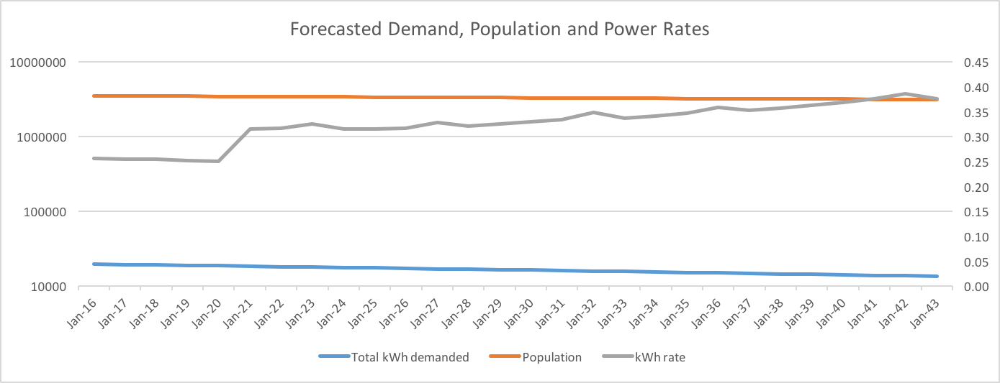
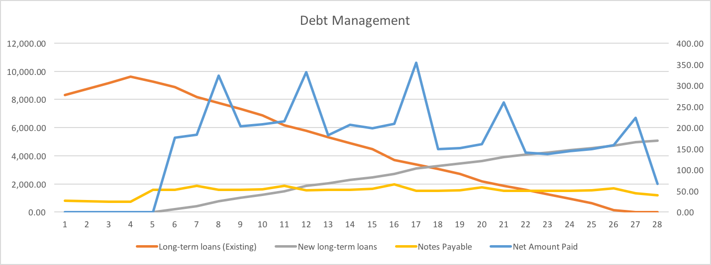

```{r setup, include=FALSE}
knitr::opts_chunk$set(echo = TRUE)
```

Over the past year, PREPA's^[Puerto Rico Electric Power Authority] restructuring has been followed closely by many distressed investors. The PREPA deal represents $8.1bn of the island's total $72bn of debt, and many thought that this transaction would set the precedent for many of the restructuring of Puerto Rico's other underwater issues, including COFINA^[Corporación del Fondo de Interés Apremiante (Puerto Rico Urgent Interest Fund Corporation)], PRASA^[Puerto Rico Aqueduct and Sewer Authority], and the general obligation bonds. Due to the precedent setting nature of this transaction, negotiations likely faced pressures from many more groups, especially the Puerto Rican government. The government's main goal was to maximize the debt haircuts as a precedent for other restructurings, and keeping electricity rates low, while creditors were all aiming for a recover as close to par as possible. After a year's worth of negotiations, both sides came to an agreement, with the principal terms being a 15% haircut on the principal, and a 5 year principal payment moratorium, all with just a ~$0.04/kWh rate hike, when otherwise an $0.11/kWh rate hike would have been necessary. At first glance, this plan therefore looks like a home run, winning points with all the interested parties. If however, we take a closer look, a far less rosy picture is painted.

The current restructuring support agreement (RSA) focuses largely on providing PREPA short to mid-term relief on debt payments. The moratorium on principal repayments on the majority of the debt will allow PREPA to offer competitive electricity rates in the short term, which we estimated to be in the mid 20 cents/kwh range, in line with current electricity prices on the Island.



However, once mandatory principal payments begin in 2021, we estimate PREPA would have to hike electricity rates jump almost 30% and continue gradually rising in order to meet these obligations.



Furthermore, because utilities have high fixed costs, the rapid population decline of Puerto Rico since the early 2000's (which is forecasted to continue) raises costs for those remaining on the island. Given the already precarious situations for residents of Puerto Rico, and the economic crisis the island is facing, significant price hikes would be unacceptable, especially given Puerto Ricans pay among the highest electricity prices in the US. To us, this makes it seem as if the assumptions used to arrive at the RSA numbers are highly optimistic, and reliant on significant improvements in economic growth. 

During the course of the PREPA negotiations, much focus has been on the short term impact, with the moratorium and short term projected electricity rates being the main sticking points. However, if more attention is not paid to the long-term impacts of the RSA, this may become a classic case of kicking the can down the road, hoping that the situation miraculously improves. Although PREPA is improving operationally, and costs are down now due to lower oil prices, the island still faces economic headwinds from the mass exodus of the population, and restrictive business environment on island. While Congress's rescue bill is an important first step in healing the island, further actions are needed for Puerto Rico to become financially healthy. One such step would be the repeal of the Jones Act, which would help lower shipping costs, and make the island more competitive. 	

*Disclaimer: All of the analysis above was performed using publicly available data.^[Source: [Utility Drive](http://www.utilitydive.com/news/puerto-rico-utility-board-approves-rate-increase-to-help-secure-restructure/419993/)] The authors recognize that the use of material non-public data may have an impact on the results, however, still feel that without significantly different numbers, a similar conclusion would be found.*

<a href="2016-08-02-PREPA-Model.pdf" target="_blank">
<button style="background-color: #555555;
    padding: 10px 30px;
    border-radius: 3px;
    font-size: 15px;
    cursor: pointer;
    border: 0px;
    color: white;
    font-weight: 100;">Download PDF Results</button>
    
<a href="2016-08-02-PREPA-Model.xlsx" target="_blank">
<button style="background-color: #555555;
    padding: 10px 30px;
    border-radius: 3px;
    font-size: 15px;
    cursor: pointer;
    border: 0px;
    color: white;
    font-weight: 100;">Download Spreadsheet</button>
